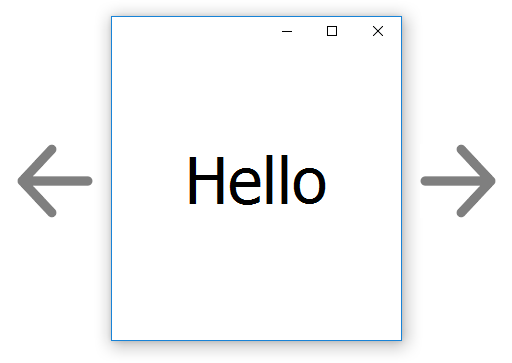

# Maximal Rectangle



## About

It is a Delphi implementation of the *maximal empty rectangle problem*[<sup>3</sup>](https://en.wikipedia.org/wiki/Largest_empty_rectangle). Interest was sparked by an article by David Vandevoorde,__The Maximal Rectangle Problem__[<sup>1</sup>](http://www.drdobbs.com/database/the-maximal-rectangle-problem/184410529).
The idea of the algorithm for solving the problem is based on a paper by Thomas M. Breuel, __Two Geometric Algorithms for Layout Analysis__[<sup>2</sup>](./research/2002-breuel-das.pdf).

__Note:__ The accompanied example app will avoid enumerating `Windows Store` based apps because of the lack of `cloaked` window detection. That requires further usage of `DwmAPI`, and more code to be written, thus is outside the scope and intentions of the example code provided.

## API

### Constructor

`TMaximalRectangle.Create(bound);`

| Names | Required | Type | Description
| --- | --- | --- | ---
| bound | `false` | `TRect` | bounding rectangle

### Properties

| Names | Description
| --- | ---
| Count | count of added obstacles
| Obstacles | returns an array of added obstacles

### Methods

| Names | Description
| --- | ---
| `SetBound()` | sets bounding rectangle
| `AddObstacle()` | adds an obstacle
| `ClearObstacles()` | clears all added obstacles
| `GetMaxWhitespace()` | returns a computed `TRect` of maximal empty rectangle space

## Usage

```delphi
procedure TfrmMain.DoFindMaximalWhiteSpace;
var
  BoundingRect : TRect;
  MaximalRect : TRect;
begin
  BoundingRect := Rect(0, 0, 1024, 512);
  Maximal := TMaximalRectangle.Create(BoundingRect);
  try
    Maximal.ClearObstacles;

    Maximal.AddObstacle(Rect(0, 0, 100, 100));

    if Maximal.GetMaxWhitespace(MaximalRect) then begin
      Self.BoundsRect := MaximalRect;
    end;
  finally
    Maximal.Free;
  end;
end;
```

## References

1. David Vandevoorde, ["The Maximal Rectangle Problem"](http://www.drdobbs.com/database/the-maximal-rectangle-problem/184410529), Dr Dobb's, 1998.

2. Thomas M. Breuel, ["Two Geometric Algorithms for Layout Analysis"](./research/2002-breuel-das.pdf), Xerox Palo Alto Research Center, 2002.

3. ["Largest empty rectangle"](https://en.wikipedia.org/wiki/Largest_empty_rectangle), In Wikipedia. Retrieved February, 2017.

## License

Maximal Rectangle is released under the MIT license.
See [LICENSE](./LICENSE.md) for details.
